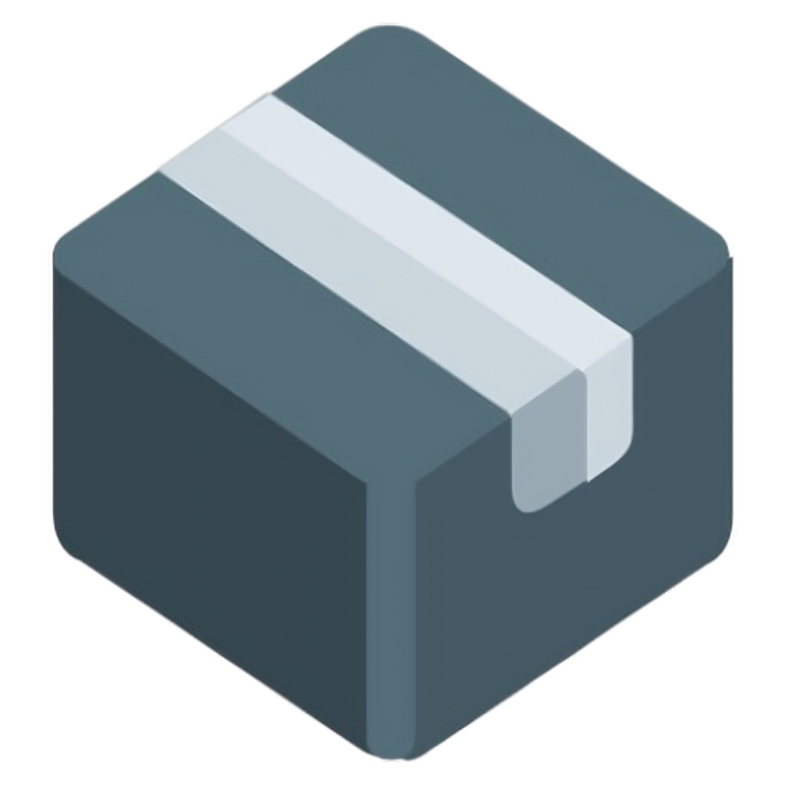

# Fear Subscription
V2rayNG Config & Hiddify Warp Subscription & Outline Access Key, Update Every <b>24</b> Hours!

##  /  V2rayNG Sub SRL
```
https://raw.githubusercontent.com/Fearwm/FearSubscription/main/V2rayNG.json
```

##  Hiddify Sub URL
```
https://raw.githubusercontent.com/Fearwm/FearSubscription/main/Hiddify.json
```

##  Sign-Box Sub URL
```
https://raw.githubusercontent.com/Fearwm/FearSubscription/main/Sign-Box.json
```

##  Outline Access Key
```
ss://Y2hhY2hhMjAtaWV0Zi1wb2x5MTMwNTpBNDdKcmZRWnJjZEtMMDR0b0lMbWps@62.210.88.22:443/?outline=1&prefix=%16%03%01%00%C2%A8%01%01#Fear-Outline-Key
```

##  V2rayNG Sub QR Code


##  Hiddify Sub QR Code


##   Telegram Channel

<a
href="https://t.me/maryv2ray">

</a>


##  Download V2rayNG
📥 <b>Download From Google Play :</b>

‌
<a href="https://play.google.com/store/apps/details?id=com.v2ray.ang"></a>

📥 <b>Download From Github :</b>

‌
[](https://github.com/2dust/v2rayNG/releases)

##  Download Hiddify
📥 <b>Download From Store :</b>

‌
<a href="https://apps.apple.com/us/app/hiddify-proxy-vpn/id6596777532?platform=iphone"></a>
‌
<a href="https://play.google.com/store/apps/details?id=app.hiddify.com"></a>
‌
<a href="https://apps.microsoft.com/detail/Hiddify/9pdfnl3qv2s5?mode=mini" target="_blank"></a>

📥 <b>Download From Github :</b>
<div align=left>
<table>
    <thead align=left>
        <tr>
            <th>OS</th>
            <th>Download</th>
        </tr>
    </thead>
    <tbody align=left>
        <tr>
        <td>iOS</td>
            <td>
                <a href="https://github.com/hiddify/hiddify-next/releases/latest/download/Hiddify-iOS.ipa"></a>
            </td>
        </tr>
        <tr>
        <td>Android</td>
            <td>
                <a href="https://github.com/hiddify/hiddify-next/releases/latest/download/Hiddify-Android-universal.apk"></a><br>
                <a href="https://github.com/hiddify/hiddify-next/releases/latest/download/Hiddify-Android-arm64.apk"></a><br>
                <a href="https://github.com/hiddify/hiddify-next/releases/latest/download/Hiddify-Android-arm7.apk"></a><br>
                <a href="https://github.com/hiddify/hiddify-next/releases/latest/download/Hiddify-Android-x86_64.apk"></a>
            </td>
        </tr>
        <tr>
            <td>Windows</td>
            <td>
                <a href="https://github.com/hiddify/hiddify-next/releases/latest/download/Hiddify-Windows-Setup-x64.Msix"></a><br>
                <a href="https://github.com/hiddify/hiddify-next/releases/latest/download/Hiddify-Windows-Setup-x64.exe"></a><br>
                <a href="https://github.com/hiddify/hiddify-next/releases/latest/download/Hiddify-Windows-Portable-x64.zip"></a>
            </td>
        </tr>
        <tr>
            <td>macOS</td>
            <td>
                <a href="https://apps.apple.com/us/app/hiddify-proxy-vpn/id6596777532"></a><br>
                <a href="https://github.com/hiddify/hiddify-next/releases/latest/download/Hiddify-MacOS.dmg"></a><br>
                <a href="https://github.com/hiddify/hiddify-next/releases/latest/download/Hiddify-MacOS-Installer.pkg"></a>
            </td>
        </tr>
        <tr>
            <td>Linux</td>
            <td>
                <a href="https://github.com/hiddify/hiddify-next/releases/latest/download/Hiddify-Linux-x64.AppImage"> </a><br>
                <a href="https://github.com/hiddify/hiddify-next/releases/latest/download/Hiddify-Debian-x64.deb"> </a><br>
                <a href="https://github.com/hiddify/hiddify-next/releases/latest/download/Hiddify-rpm-x64.rpm"> </a>
            </td>
        </tr>
    </tbody>
</table>

##  Download Sign-Box
📥 <b>Download From Google Play :</b>

‌
<a href="https://play.google.com/store/apps/details?id=io.nekohasekai.sfa">

</a>

📥 <b>Download From Github :</b>

‌
[](https://github.com/SagerNet/sing-box/releases)

##  Download Outline
📥 <b>Download From Google Play :</b>

‌
<a href="https://play.google.com/store/apps/details?id=org.outline.android.client">

</a>

📥 <b>Download From Github :</b>

‌
[](https://github.com/Jigsaw-Code/outline-apps/releases)
